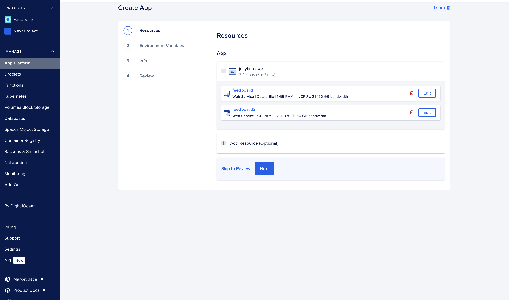
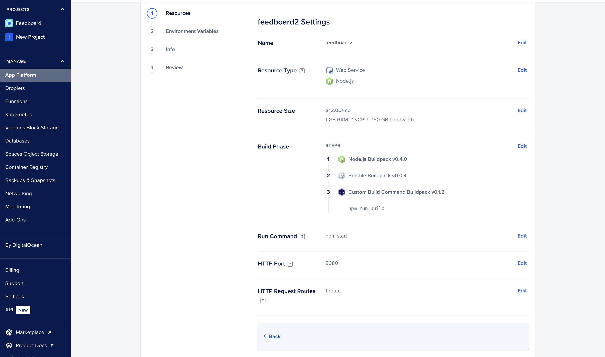
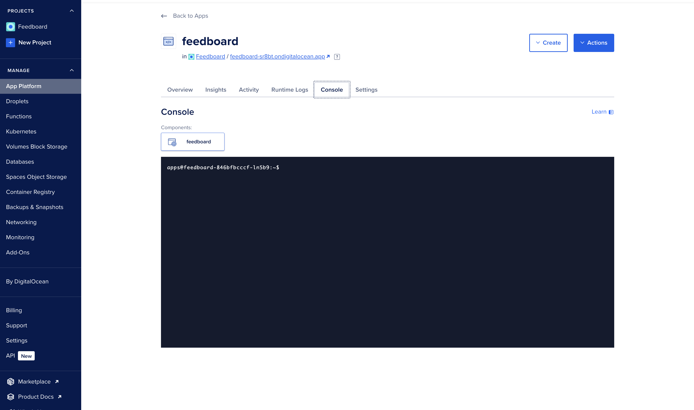

# Deployment

## Prerequisites

- Fork the repository.
- Set up a managed Postgres instance.
- Configure the [environment variables](../README.md).

## DigitalOcean App Platform

1. Go to [DigitalOcean App Platform](https://cloud.digitalocean.com/apps/new).
2. Select `GitHub` as the Provider.
3. Provide access to the forked `Feedboard` repository.
4. Make sure the Branch is set to `main` and the Source Directory is `/`.
5. Click Next.
6. In the Resources section, you could delete the first resource. 

Feel free to increase/decrease the size of the allocated resources.
7. Ensure you have these settings for the selected resource.

8. You can change the HTTP Request Routes to `/`
9. Set the environment variables for the app.
10. Review your configuration.
11. Press Create Resources.
12. Once deployed, go to the Console for your deployed app, and run these commands:
    1. `npm run prisma:generate`
    2. `npm run prisma:migrate:deploy`
    3. `npm run create-superuser`

## FAQ

#### How do I set up a managed Postgres instance?

- [Amazon RDS for PostgreSQL](https://aws.amazon.com/rds/postgresql/)
- [Azure Database for PostgreSQL](https://azure.microsoft.com/en-us/products/postgresql/#overview)
- [Digital Ocean Managed Postgres](https://www.digitalocean.com/products/managed-databases-postgresql)
- [Google Cloud SQL for PostgreSQL](https://cloud.google.com/sql/docs/postgres/)
- [Heroku Managed Data Services](https://www.heroku.com/managed-data-services)
